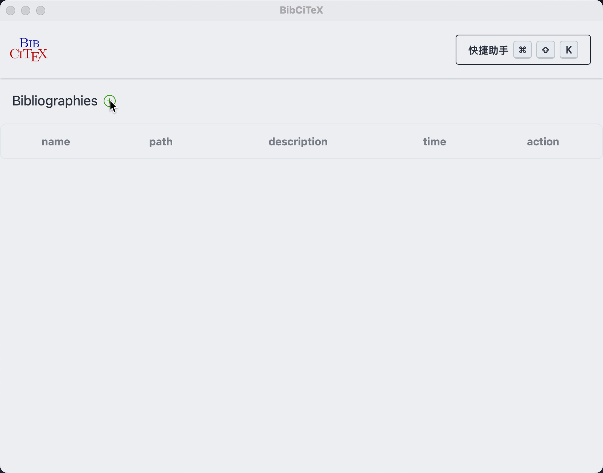
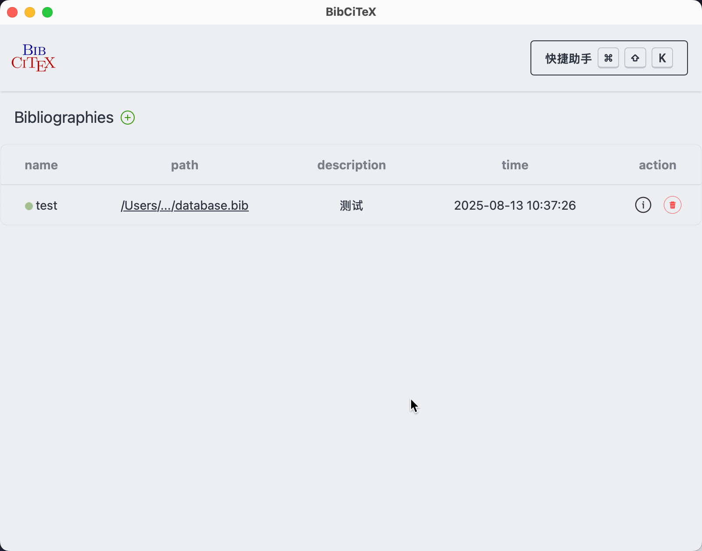
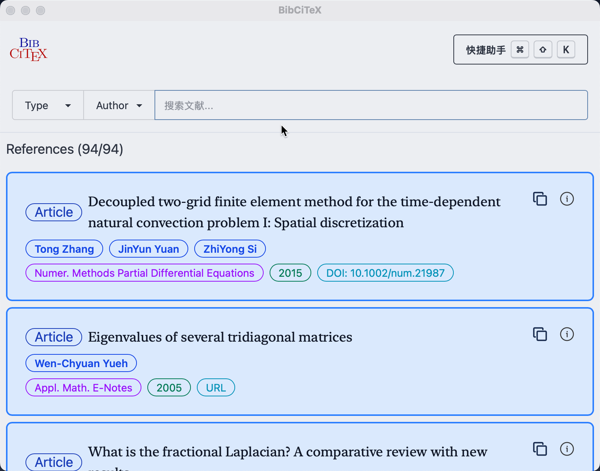
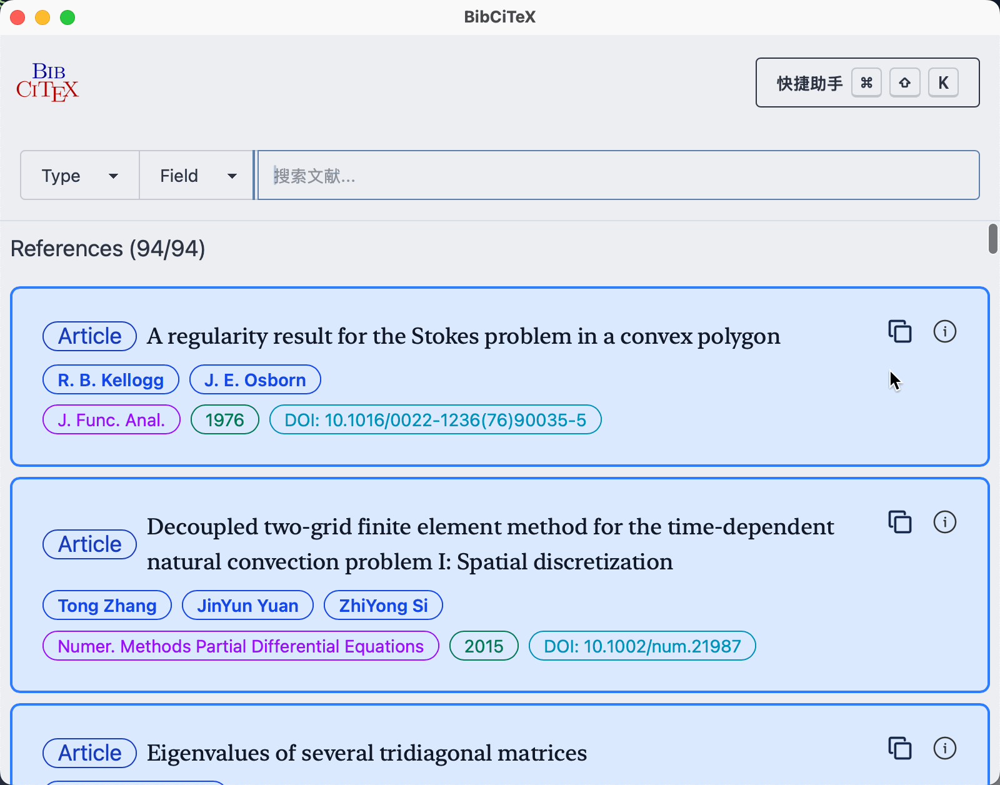
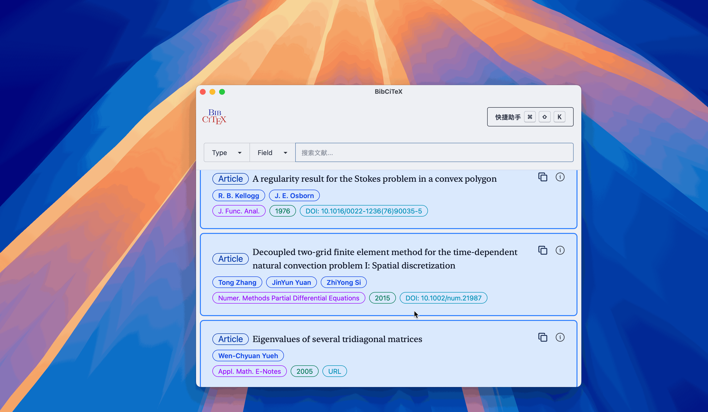
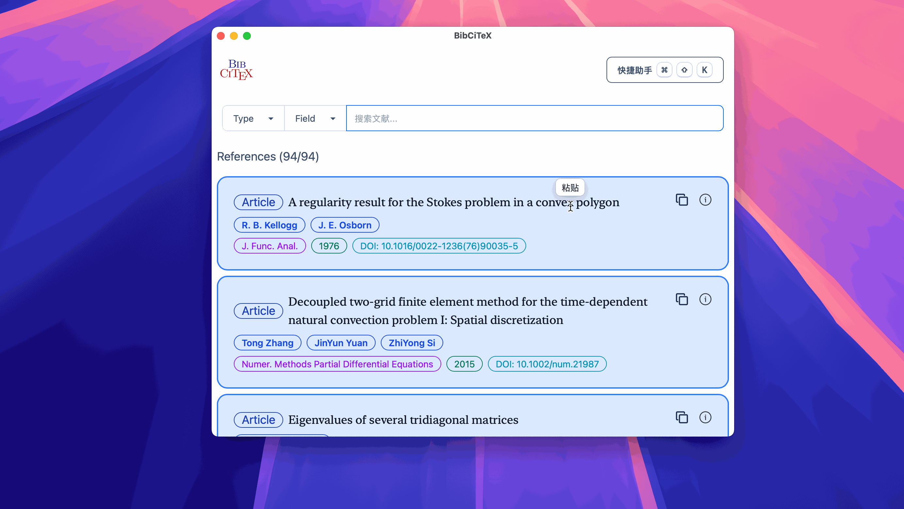
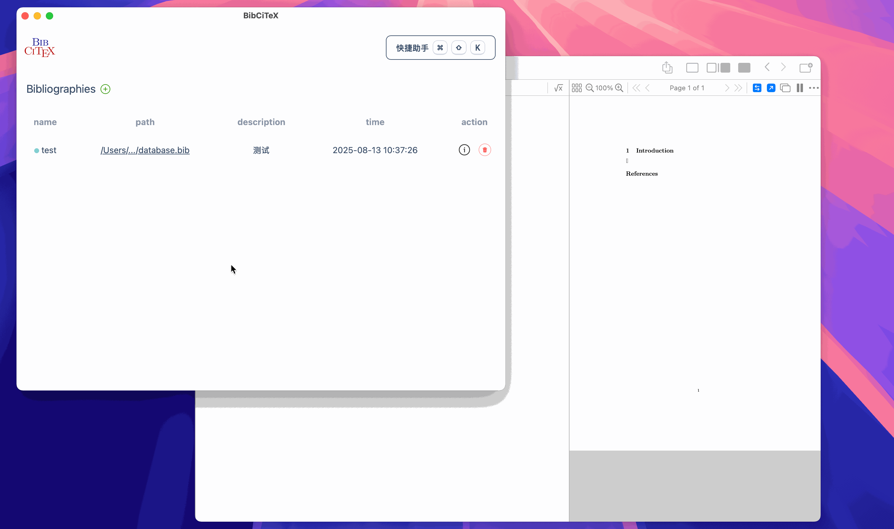

<div align="center">
  

  <p><a href="README.md">English</a> | 简体中文</p>

  <p>
    BibTeX 文献快捷引用工具
  </p>

  <p>
    <a href="https://github.com/tangxiangong/bibcitex/releases">
      
    </a>
    <a href="https://github.com/tangxiangong/bibcitex/blob/main/LICENSE-MIT">
      
    </a>
  </p>

  <p>
    <strong>快速下载</strong>
  </p>

  <p>
    <a href="https://github.com/tangxiangong/bibcitex/releases/download/v0.7.3/BibCiTeX-0.7.3-macos-arm64.dmg">
      
    </a>
    <a href="https://github.com/tangxiangong/bibcitex/releases/download/v0.7.3/BibCiTeX-0.7.3-macos-x86_64.dmg">
      
    </a>
    <a href="https://github.com/tangxiangong/bibcitex/releases/download/v0.7.3/BibCiTeX-0.7.3-windows-arm64.exe">
      
    </a>
    <a href="https://github.com/tangxiangong/bibcitex/releases/download/v0.7.3/BibCiTeX-0.7.3-windows-x64.exe">
      
    </a>
  </p>
</div>

## 简介

**BibCiTeX** 是一个以 **Rust** 为核心的 **BibTeX** 文献快捷引用工具。

支持 macOS 与 Windows，提供文献搜索、引用复制和跨应用粘贴功能。

v0.7.3 更新内容：[中文发布说明](release-notes/0.7.3/zh-Hans.md) · [English release notes](release-notes/0.7.3/en.md)。

### 核心特性

- **一键复制**: 便捷的引用复制功能
- **跨应用粘贴**: 无缝集成到您的工作流程

## 安装指南

### 支持的系统

| 平台 | 支持的系统版本 | 架构 |
| --- | --- | --- |
| macOS | macOS 13（Ventura）及以上 | Apple Silicon（ARM64）、Intel（x86_64） |
| Windows | Windows 10 1809（操作系统内部版本 17763）及以上，包括 Windows 11 | x64、ARM64 |

### 下载

从 [**Release 页面**](https://github.com/tangxiangong/bibcitex/releases) 下载对应平台架构的最新版本安装包。

### macOS 安装说明

也可以通过项目维护的 [Homebrew tap](https://github.com/tangxiangong/homebrew-tap) 安装，支持 macOS 13 及以上的 Apple Silicon 和 Intel Mac：

```bash
brew install --cask tangxiangong/tap/bibcitex
```

应用支持内置更新。如需通过 Homebrew 更新，执行 `brew update` 后运行 `brew upgrade --cask --greedy bibcitex`。

若提示 `BibCiTeX` 已损坏，请打开终端执行以下命令：

```bash
sudo xattr -dr com.apple.quarantine /Applications/BibCiTeX.app
```

> **提示**: 这是由于 macOS 的安全机制导致的，执行上述命令后即可正常使用。

## 界面功能预览

以下动图来自历史版本。

<div align="center">

### 核心功能展示

|                          添加 `.bib` 文件                          |                                   文献列表                                   |                             智能搜索                             |
| :----------------------------------------------------------------: | :--------------------------------------------------------------------------: | :--------------------------------------------------------------: |
| [](./assets/add_bib.gif) | [](./assets/show_details.gif) | [](./assets/search.gif) |
|                       *快速导入 BibTeX 文件*                       |                              *查看文献详细信息*                              |                          *实时搜索过滤*                          |

|                             侧边详情                             |                          外部链接                          |                           复制引用                           |
| :--------------------------------------------------------------: | :--------------------------------------------------------: | :----------------------------------------------------------: |
| [](./assets/drawer.gif) | [](./assets/url.gif) | [](./assets/copy.gif) |
|                         *侧边栏详情展示*                         |                     *快速访问外部资源*                     |                      *一键复制引用格式*                      |

### 特色功能

<div style="margin: 20px 0;">
  <h4>跨应用粘贴</h4>
  <a href="assets/cross_paste.gif">
    
  </a>
  <p><em>无缝集成到您的工作流程，支持跨应用程序粘贴功能</em></p>
</div>

</div>

## TODO

详细待办见 [TODO.md](./TODO.md)。

- [x] **普通搜索增强**：多关键词、模糊匹配、相关性排序与性能优化。
- [ ] **高级搜索**：支持字段查询、精确短语、排除条件及年份范围。
- [ ] **Tag 功能**：标签管理、批量添加与移除，以及标签筛选。
- [ ] **Helper 筛选指令**：输入 `@`、`$`、`#` 分别显示文献类型、字段、标签候选，并提供小输入框完成筛选。
- [ ] **多选功能**：主窗口与 helper 支持多篇选择及批量操作。
- [ ] **复制与粘贴格式**：支持裸 cite key、LaTeX 和 Typst 引用预设，以及多篇引用组合。

## 第三方代码版权声明

### [crates/xpaste](./crates/xpaste)
- **来源**: [EcoPasteHub/EcoPaste](https://github.com/EcoPasteHub/EcoPaste)
- **作者**: EcoPasteHub
- **许可协议**: [Apache 2.0](https://github.com/EcoPasteHub/EcoPaste/blob/master/LICENSE)
- **用途**: 实现跨应用的粘贴功能
- **版权声明**:
  ```
  Copyright (c) EcoPasteHub
  ```
- **主要修改**:
  -  macOS: 将过时的 `objc` 和 `cocoa` 替换为 `objc2` 相关的 API
  - Windows: 将过时的 `winapi` 替换为 `windows-sys` 相关的 API

---

> **详细信息**: 完整的归属信息请参阅 [**NOTICE**](./NOTICE) 文件

## 许可协议

本项目采用双重许可协议，您可以选择其中任意一种：

* **Apache License, Version 2.0** ([LICENSE-APACHE](LICENSE-APACHE) 或 https://www.apache.org/licenses/LICENSE-2.0)
* **MIT License** ([LICENSE-MIT](LICENSE-MIT) 或 https://opensource.org/licenses/MIT)

### 贡献声明
除非您明确声明，否则根据 Apache-2.0 许可协议的定义，您有意提交的任何贡献都将按照上述双重许可协议进行许可，不附加任何额外条款或条件。
