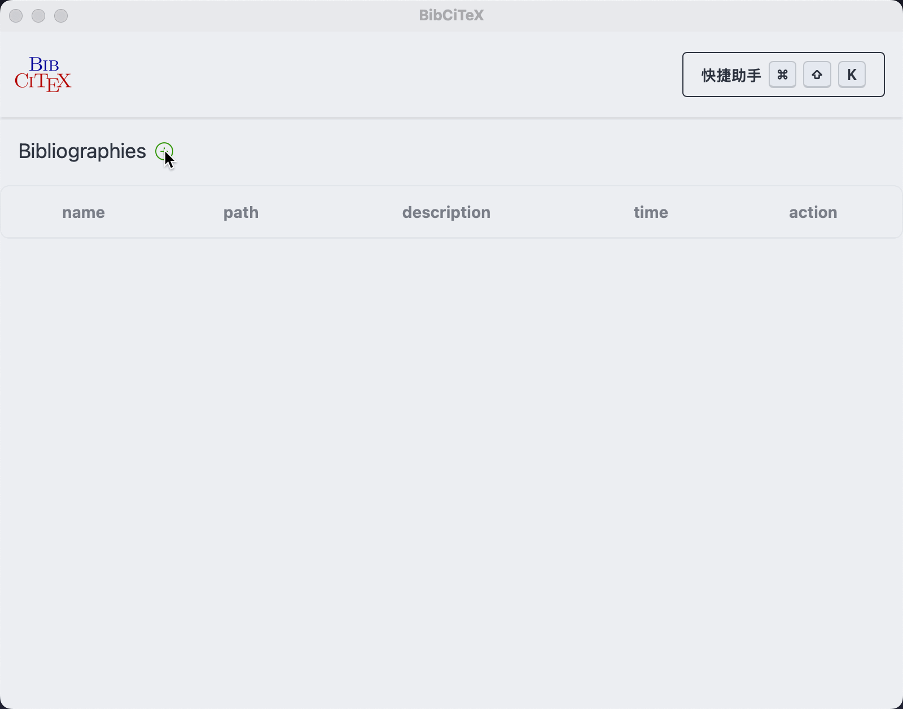
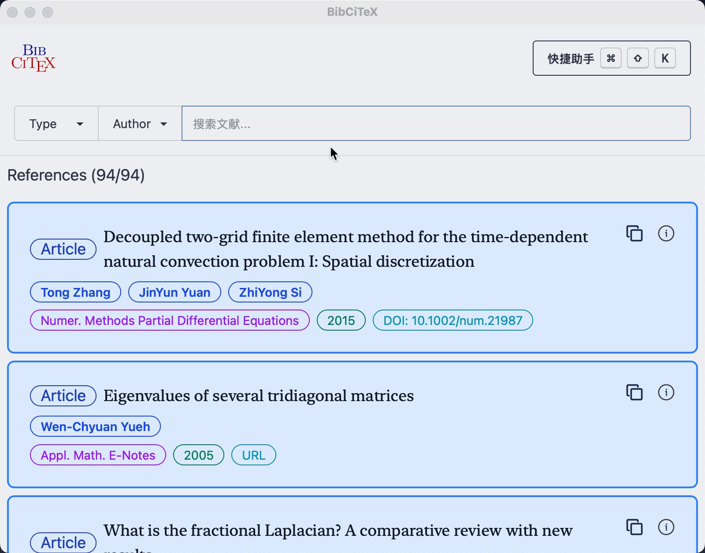
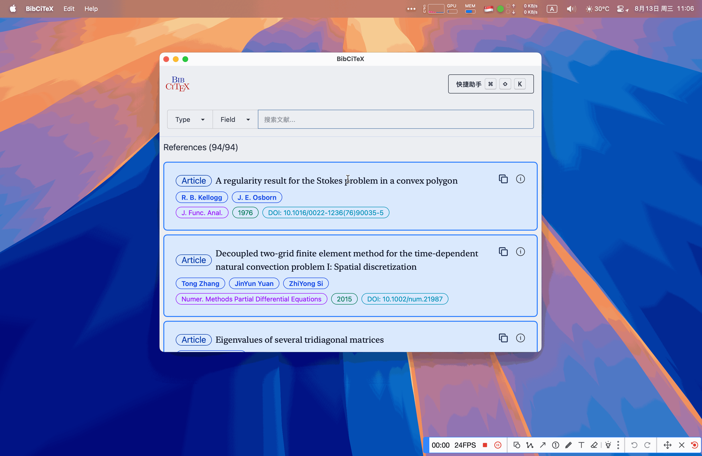
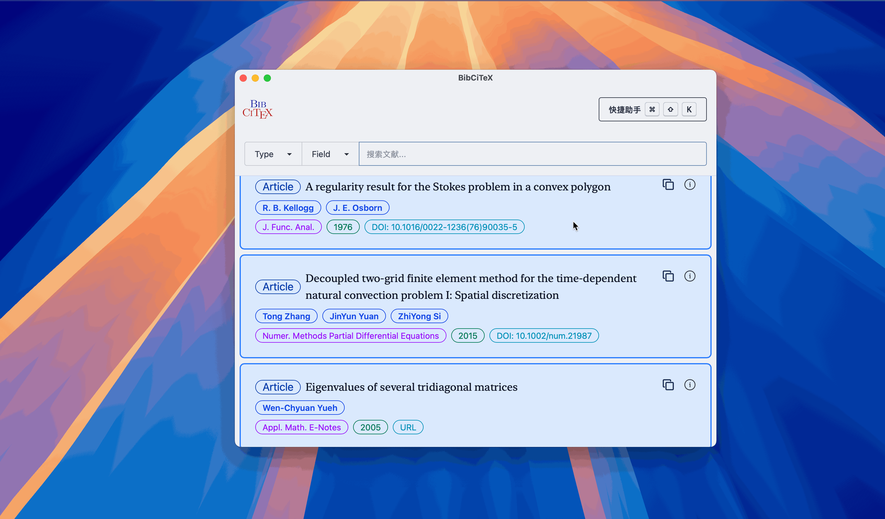

<div align=center>

<p align="center">
      文献快捷引用工具
</p>
</div>

## 简介

 是一个使用 🦀 Rust 和 [ Dioxus](https://dioxuslabs.com) 框架开发的跨平台  文献快捷引用工具。

### 平台
- [x] macOS (arm64/x86_64)
- [x] Windows (arm64/x86_64)
- [ ] Linux

### 安装
对于 macOS 用户，若提示 `BibCiTeX` 已损坏，需要打开终端，执行以下命令：
```bash
sudo xattr -dr com.apple.quarantine /Applications/BibCiTeX.app
```

### 文献类型
- [x] Article
- [x] Book
- [x] Thesis(PhDThesis && MastersThesis)
- [x] Booklet
- [x] InBook
- [x] InCollection
- [ ] Manual
- [x] Misc
- [ ] Proceedings
- [x] TechReport
- [x] InProceedings
- [ ] Unpublished

## 界面功能预览
<div align="center">

| 添加 `.bib` 文件 | 文献列表 | 搜索 |
| :---: | :---: | :---: |
| [](./assets/readme/add_bib.gif) | [](./assets/readme/show_details.gif) | [](./assets/readme/search.gif) |

| 侧边详情 | 外部链接 | 复制引用 |
| :---: | :---: | :---: |
| [](./assets/readme/drawer.gif) | [](./assets/readme/url.gif) | [](./assets/readme/copy.gif) |

</div>

<div align="center">
<figure>
<a href="assets/readme/cross_paste.gif">

</a>
<figcaption>跨应用粘贴</figcaption>
</figure>
</div>


## 开发路线图
### 进行中
- [x] 文献库删除功能
- [x] 跨应用粘贴功能
  - [x] macOS
  - [x] Windows
  - [x] Linux (x11)
- [ ] 完整的搜索功能优化
- [ ] 完善文献分类和标签系统

### 计划中
- [ ] macOS 系统级无焦点窗口实现 (NSPanel)
- [ ] 自定义设置

### UI/UX 改进
- [ ] 完整的 UI 设计系统
- [ ] 自定义主题支持
- [ ] 更好的响应式设计

## 第三方代码版权声明 (Third-Party Code Attribution)
### [crates/nspanel](./crates/nspanel) (WIP)
- **来源(Source)**: [ahkohd/tauri-nspanel](https://github.com/ahkohd/tauri-nspanel) (v2.1)
- **作者(Author)**: Victor Aremu (ahkohd)
- **许可协议(License)**: [MIT](https://github.com/ahkohd/tauri-nspanel/blob/v2.1/LICENSE_MIT) OR [MIT](https://github.com/ahkohd/tauri-nspanel/blob/v2.1/LICENSE_MIT)/[Apache 2.0](https://github.com/ahkohd/tauri-nspanel/blob/v2.1/LICENSE_APACHE-2.0)
- **用途(Usage)**: 为 Dioxus 框架适配 macOS NSPanel 功能 (Adapted macOS NSPanel functionality for Dioxus framework)
- **版权声明(Copyright)**:
  ```
  Copyright (c) 2023 - Present Victor Aremu
  ```
- **主要修改(Key Modifications)**:
  - 从 Tauri 框架适配为 Dioxus 框架 (Adapted from Tauri framework to Dioxus framework)
  - 移除 Tauri 特定的运行时集成 (Removed Tauri-specific runtime integration)

### [crates/xpaste](./crates/xpaste)
- **来源(Source)**: [EcoPasteHub/EcoPaste](https://github.com/EcoPasteHub/EcoPaste)
- **作者(Author)**: EcoPasteHub
- **许可协议(License)**: [Apache 2.0](https://github.com/EcoPasteHub/EcoPaste/blob/master/LICENSE)
- **用途(Usage)**: 实现跨应用的粘贴功能 (Cross-application paste functionality)
- **版权声明(Copyright)**:
  ```
  Copyright (c) EcoPasteHub
  ```
- **主要修改(Modifications)**:
  -  macOS: 将过时的 `objc` 和 `cocoa` 替换为 `objc2` 相关的 API (Replace deprecated `objc` and `cocoa` with `objc2` related APIs)
  - Windows: 将过时的 `winapi` 替换为 `windows-sys` 相关的 API (Replace deprecated `winapi` with `windows-sys` related APIs)
  - Linux (x11): 将 `rdev` 替换为 `enigo`  (Replace `rdev` with `enigo`)


详细的归属信息请参阅 [NOTICE](./NOTICE) 文件 (For detailed attribution information, please refer to the [NOTICE](./NOTICE) file)。

## 许可协议

本项目采用双重许可协议，您可以选择其中任意一种：

* **Apache License, Version 2.0** ([LICENSE-APACHE](LICENSE-APACHE) 或 https://www.apache.org/licenses/LICENSE-2.0)
* **MIT License** ([LICENSE-MIT](LICENSE-MIT) 或 https://opensource.org/licenses/MIT)

### 贡献声明
除非您明确声明，否则根据 Apache-2.0 许可协议的定义，您有意提交的任何贡献都将按照上述双重许可协议进行许可，不附加任何额外条款或条件。
